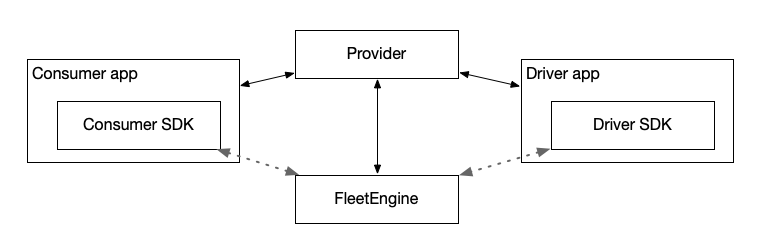

# On-Demand Rides and Deliveries Android Samples

This repository contains the source code of the following samples

1. Driver SDK sample (written in Java) in `/java/driver` directory.
2. Consumer SDK sample (written in Java) in `/java/consumer` directory.

## Architecture

In order to run the full end-to-end **journey sharing** use case, you need 3
components:

- a driver app (included in this repository)
- a consumer app (included in this repository)
- a provider backend (included in a
  [separate repository](https://github.com/googlemaps/java-on-demand-rides-deliveries-stub-provider),
  as it can be utilized by both Android and iOS client samples.)



As depicted in the figure:

- The consumer app and driver app communicate with the provider backend using
  REST service calls.
- The provider backend also communicates with the Fleet Engine.

The end result should be as follows:


## Getting started

**NOTE**: The following instructions assume your project has gone through the
Google Maps Platform
[Get Started steps](https://developers.google.com/maps/gmp-get-started), a
project in Google Cloud Console has been set up, and you have the appropriate
API keys.

### Step 1 - Set up Google Cloud CLI (required)

Follow the [official guide](https://cloud.google.com/sdk/docs/install) to
install and setup Google Cloud CLI. This will help you easily pull gated SDK
artifacts into the Gradle projects.

Verify that the
[credentials helper plugin](https://developers.google.com/maps/documentation/transportation-logistics/android_sdk_setup#option_1_using_the_credentials_helper_plugin_recommended)
works on your DEV machine correctly.

### Step 2 - Add API key and other metadata (required)

In the root `local.properties` file, append the following lines
```
MAPS_API_KEY=YOUR_API_KEY
PROVIDER_ID=YOUR_PROVIDER_ID
PROVIDER_URL=YOUR_PROVIDER_BASE_URL
```

**NOTE**: The logic of reading provider ID and URL is in `ProviderUtils.java`.
When changing `android:name="com.example.driver.sampleapp.provider_url"`, be
sure to update the static fields in it.

### Step 3 - Build and run

Import your project to Android Studio, or use Gradle to build and run the
project.

```bash
./gradlew :java:driver:assembleDebug
```

```bash
./gradlew :java:consumer:assembleDebug
```

The binary targets are `java.driver` and `java.consumer`.

## Important references

- [Installing Cloud SDK](https://cloud.google.com/sdk/docs/install)
- [Transportation SDKs - Android SDK Setup](https://developers.google.com/maps/documentation/transportation-logistics/android_sdk_setup)
- [Option 1: Using the credentials helper plugin (recommended)](https://developers.google.com/maps/documentation/transportation-logistics/android_sdk_setup#option_1_using_the_credentials_helper_plugin_recommended)
